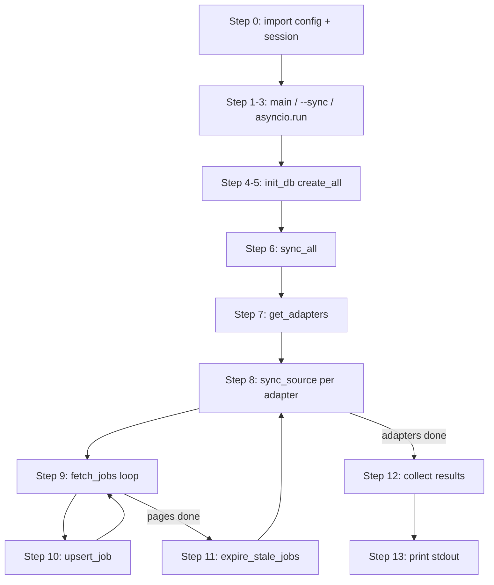
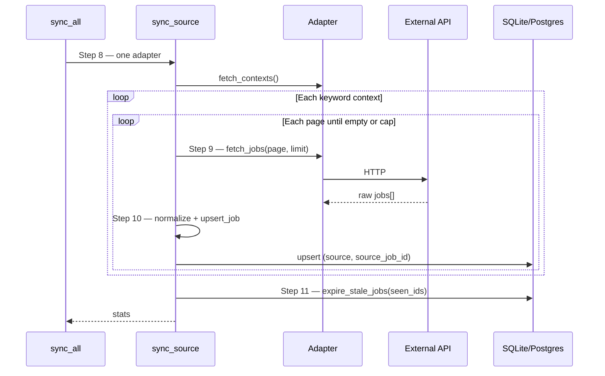
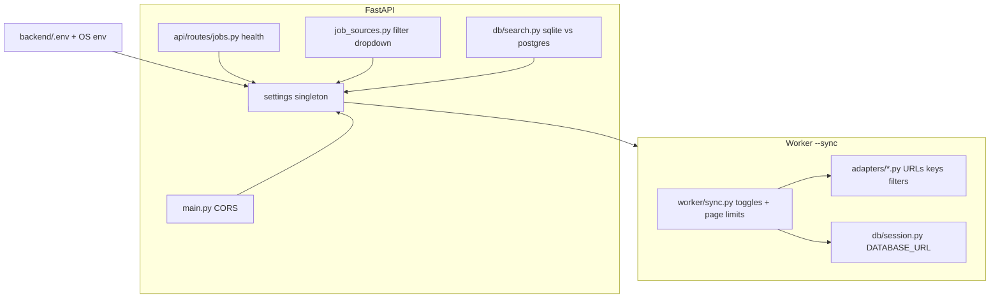
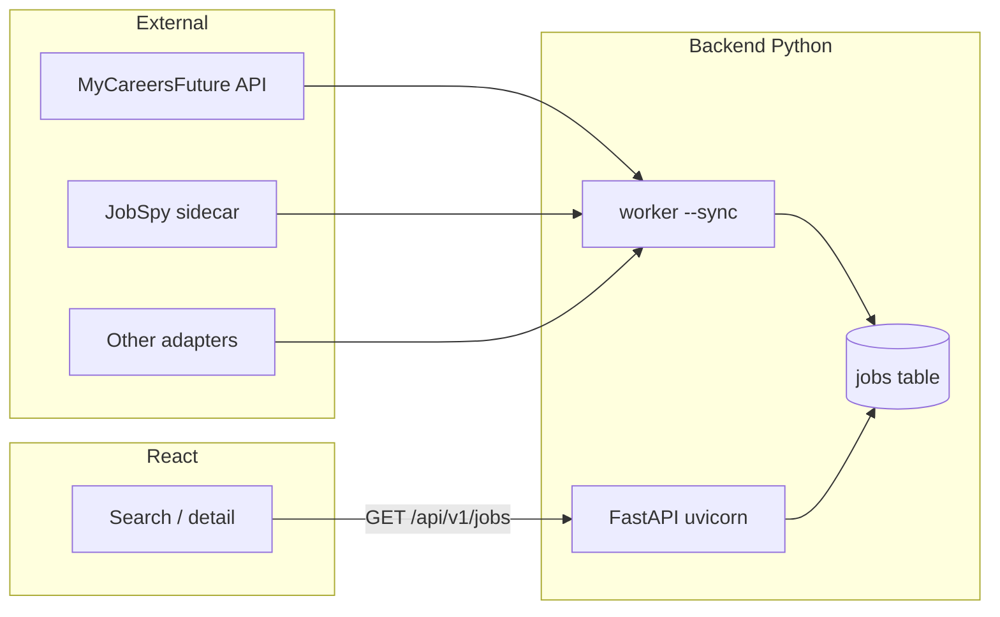

# Worker sync trace and configuration mental model

How `uv run python -m app.worker --sync` runs end-to-end, and how `backend/.env` flows through the backend. Use this as a reading guide alongside the code (inline comments use the same **Step N** labels).

**Run from:** `backend/` directory so `app` resolves.

```bash
cd backend
uv run python -m app.worker --sync
```

Related: [Job ingestion overview](job-ingestion.md) (adapters, expiry, API vs worker).

---

## Part 1 — Numbered trace (`--sync`)

Read these steps in order. File paths are under `backend/app/`.

| Step | Where | What happens |
|------|--------|----------------|
| **0** | `config.py`, `db/session.py` | **Import time** (before `main()`): `settings = Settings()` loads `backend/.env` + OS env; `engine` / `SessionLocal` bind to `DATABASE_URL`. |
| **1** | `worker/__main__.py` → `main()` | CLI entry when Python runs `-m app.worker`. |
| **2** | `worker/__main__.py` | `argparse` sees `--sync`. |
| **3** | `worker/__main__.py` | `asyncio.run(run_sync())` — one event loop for the whole job. |
| **4** | `worker/__main__.py` → `run_sync()` | Calls `init_db()` before ingestion. |
| **5** | `worker/__main__.py` → `init_db()` | `Base.metadata.create_all(bind=engine)` — creates `jobs` table if missing (not Alembic). |
| **6** | `worker/sync.py` → `sync_all()` | Top-level ingestion; scheduler uses the same function. |
| **7** | `worker/sync.py` → `get_adapters()` | Builds adapter list from `*_ENABLED` flags + `is_configured()` (credentials/URLs). Order: MCF → Jobicy → Adzuna → LinkedIn → JobSpy. |
| **8** | `worker/sync.py` → `sync_source(adapter)` | Once per adapter; errors isolated per source. |
| **9** | `worker/sync.py` + `adapters/<source>/adapter.py` | For each fetch context and page: `await adapter.fetch_jobs(FetchParams(...))` (HTTP/API). |
| **10** | `worker/sync.py` → `_upsert_batch()` → `db/upsert.py` → `upsert_job()` | `normalize()` each raw dict → insert or update row by `(source, source_job_id)`, `status=active`. |
| **11** | `worker/sync.py` → `db/upsert.py` → `expire_stale_jobs()` | Active jobs for that canonical `source` **not** seen in step 10 → `expired`. |
| **12** | `worker/sync.py` → `sync_all()` | Append per-source stats (`fetched`, `upserted`, `expired`) or `error` / `skipped`. |
| **13** | `worker/__main__.py` → `run_sync()` | Print each result dict to stdout. |

### Flow diagram (CLI sync)



### Inside `sync_source` (steps 8–11)



**Note:** `scheduler.py` is **not** on this path. It calls `sync_all()` on a cron schedule when you run the scheduler process separately.

---

## Part 2 — Configuration mental model

There is **no** FastAPI-style dependency injection for settings. The pattern is a **module singleton**:

```python
# config.py (Step 0 on first import)
settings = Settings()
```

Any module does `from app.config import settings` and reads fields directly. Values are fixed for the life of the process — change `.env` and **restart** worker/API.

### Resolution order (highest wins)

1. Field defaults in `Settings` class (`config.py`)
2. `backend/.env` (path is fixed next to the backend package, not shell cwd)
3. OS environment variables (`DATABASE_URL`, `MCF_ENABLED`, …)

Field `snake_case` → env `UPPER_SNAKE_CASE` (e.g. `adzuna_app_key` → `ADZUNA_APP_KEY`).

### Who reads `settings`?



| Layer | Module | Typical settings |
|-------|--------|------------------|
| Database | `db/session.py` | `database_url`, `database_backend` |
| Worker orchestration | `worker/sync.py` | `*_enabled`, `*_page_size`, `*_max_pages` |
| Adapters | `adapters/*/adapter.py` | API keys, base URLs, search filters (LinkedIn keywords, Jobicy geo, …) |
| API | `main.py` | `cors_origins` |
| API | `api/routes/jobs.py` | `database_backend` (health) |
| API filters | `job_sources.py` | Same enable flags as sync + JobSpy site list |
| Search | `db/search.py` | `database_backend` (JSON location query shape) |

**Two consumers of the same `.env`:**

- **Worker** (`get_adapters`) — what gets **ingested**.
- **`job_sources.list_job_source_options`** — what the **frontend source filter** shows.

They should stay aligned but serve different endpoints.

### Adapter registration rules (`get_adapters`)

| Type | Sources | Rule |
|------|---------|------|
| Toggle-only | MyCareersFuture, Jobicy | Append if `MCF_ENABLED` / `JOBICY_ENABLED` |
| Credential-gated | Adzuna, LinkedIn, JobSpy | Append if `adapter.is_configured()`; if enabled but misconfigured, log and skip |

Pagination caps and batch sizes come from **`sync.py`** (`settings` → `_PAGE_SIZE_BY_SOURCE`, `_MAX_PAGES_BY_SOURCE`), not from adapter constructors.

---

## Part 3 — Whole setup (worker + API + frontend)



| Path | Reads external job APIs? | Reads DB? |
|------|---------------------------|-----------|
| `python -m app.worker --sync` | Yes (via adapters) | Yes (write) |
| `GET /api/v1/jobs` | **No** | Yes (read active only) |

Frontend does **not** import `config.py`; it calls the API (Vite may proxy `/api` in dev).

---

## Code map (quick links)

| Step(s) | File |
|---------|------|
| 0 | `app/config.py`, `app/db/session.py` |
| 1–5, 13 | `app/worker/__main__.py` |
| 6–12 | `app/worker/sync.py` |
| 9 | `app/adapters/base.py`, `app/adapters/<source>/adapter.py` |
| 10–11 | `app/db/upsert.py` |
| Models | `app/models/schemas.py` (`CanonicalJobInput`), `app/models/orm.py` (`Job`) |

Master index duplicated in the module docstring of `app/worker/__main__.py` for in-editor navigation.
